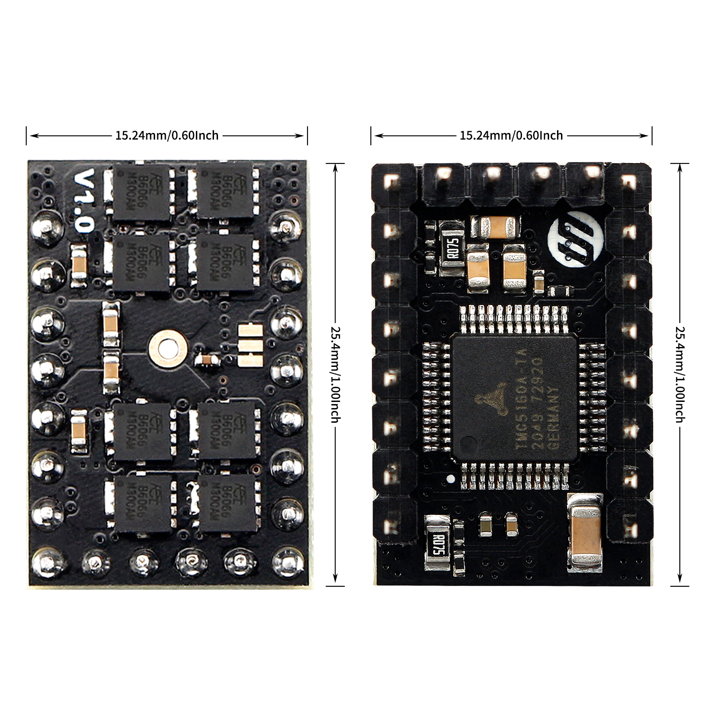
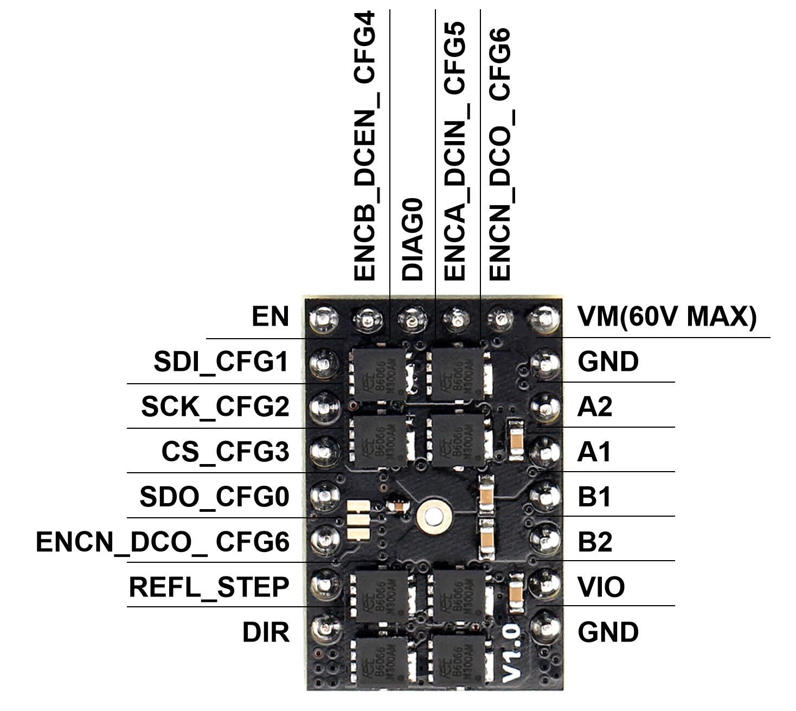
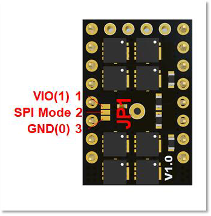
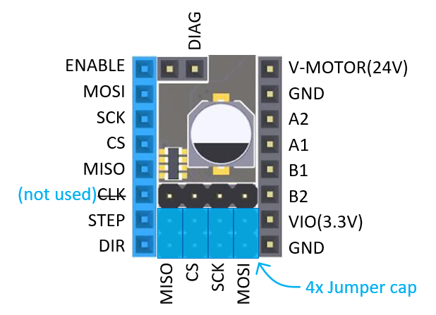
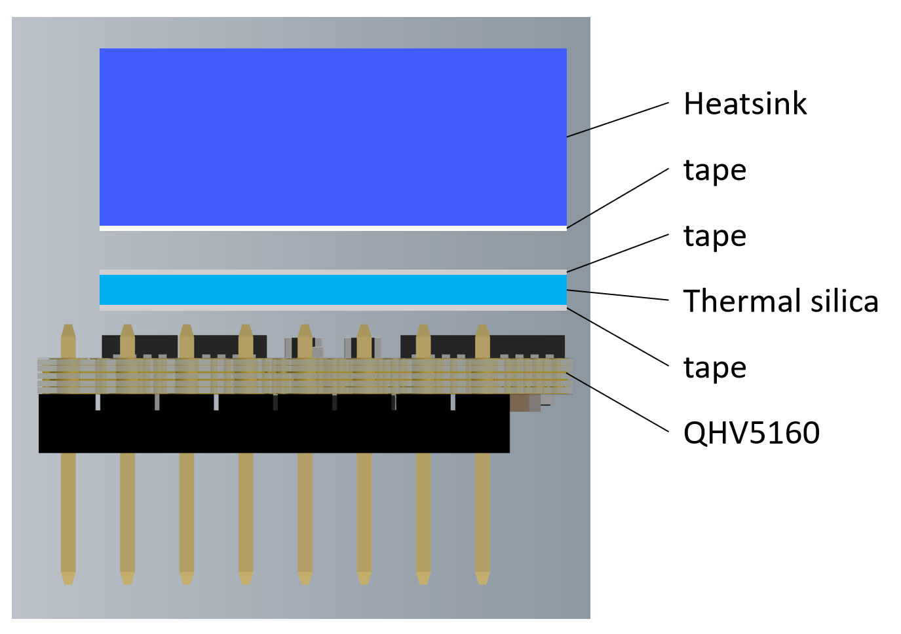
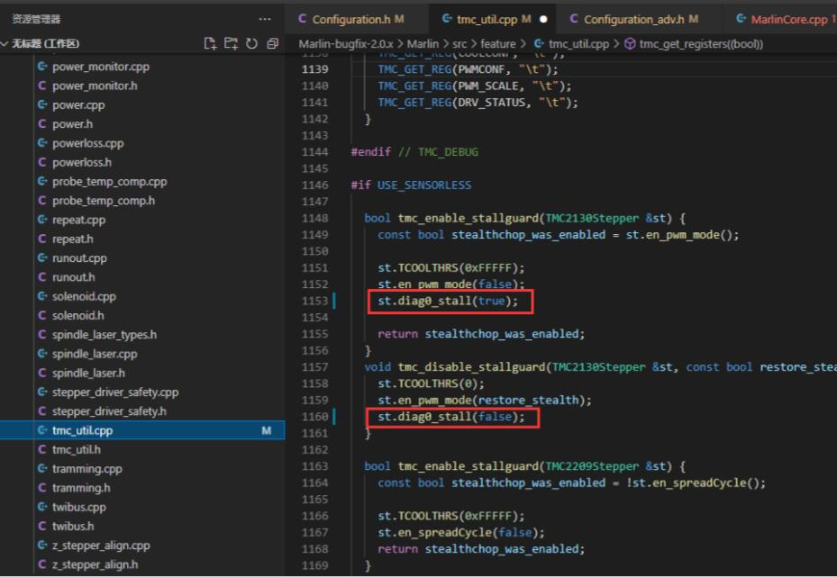

# QHV5160

## 1. Introduction

QHV5160 is a upgrade of HV5160, specially designed for high-voltage drive requirements and can work in the voltage range of 8-60V, such as 48V. The new design uses the QFP package of TMC5160, and selects eight 3x3 low-resistance MOSFETs.  and also uses Samsung Electronics’ 100V X7R ceramic capacitors

## 2. Feature

- 900 x 600mil / 22.3 x 15.24mm
- 6 layer TG155 PCB
- 8-60V 3.0A (rms) / 4.2A (peak)【Be constrained by connectors, not components.】
- 8 x NMOS (4.4 mΩ)
- Step/Dir interface & SPI mode default
- Compatible with Stepstick Pins
- Encoder Interface pinout
- DIAG output for sensorless homing
- With thermally conductive silicone and extra strong aluminum heatsink.

## 3. Application

3D printers, CNCs, engraving machines, or other similar devices with stepper motors.

## 4. Specifications

|                          | TMC5160                                                 | HV5160                          | QHV5160                     |
| ------------------------ | ------------------------------------------------------- | :------------------------------ | --------------------------- |
| Motor Voltage (VM)       | 8-40V                                                   | 8-60V                           | 8-60V                       |
| Size                     | 800  x 600mil / 20.32 x 15.24mm                         | 1000  x 600mil / 25.4 x 15.24mm | 900 x 600 mil /22.3 x 15.24 |
| MOSFET                   | 4x  WSD4066 （17mΩ）                                    | 4x  DMT6018 (17  mΩ)            | 8x 4.4mΩ NMOS               |
| Heatsink                 | 238.6  W/(m·K)铝散热片                                  | 393.6  W/(m·K)纯铜散热片        | 238.6  W/(m·K)铝散热片      |
| Motor Phase Current  max | 3.0A  (rms) / 4.2A (peak)                               |                                 |                             |
| Rs                       | 0.075Ω                                                  |                                 |                             |
| Default Mode             | SPI  Mode，Standalone mode selectable via solder option |                                 |                             |
| PCB layer                | 6层，TG155                                              |                                 |                             |
| Pinout                   | DIAG0  & Encoder Interface pinout                       |                                 |                             |
| Native Microsteps        | up to 1/256                                             |                                 |                             |
| microPlyer Microsteps    | 1/256                                                   |                                 |                             |
| Logic Voltage (VIO)      | 3-5V                                                    |                                 |                             |
| Internal V-Regulator     | enabled                                                 |                                 |                             |
| stealthChop (quiet)      | yes                                                     |                                 |                             |
| spreadCycle              | yes                                                     |                                 |                             |
| coolStep                 | yes                                                     |                                 |                             |
| stallGuard               | yes                                                     |                                 |                             |
| dcStep                   | yes                                                     |                                 |                             |

## 5. Hardware Guide

### 5.1 Pin Functions

|            Pin            | Function                                                     |
| :-----------------------: | ------------------------------------------------------------ |
|                           | **Power Supply**                                             |
|            GND            | Ground                                                       |
|            VM             | Motor Supply Voltage, Provide filtering capacity  near  pin  with short loop to  GND plane.  Must be tied to the  positive bridge supply voltage. |
|            VIO            | 3.3V to 5V IO supply voltage for all digital pins.           |
|                           | **Motor Outputs**                                            |
|            B1             | Motor Coil 1                                                 |
|            B2             | Motor Coil 1                                                 |
|            A1             | Motor Coil 2                                                 |
|            A2             | Motor Coil 2                                                 |
|                           | **Control Inputs**                                           |
|         REFL_STEP         | STEP input when (SD_MODE=1). or left reference input (for internal ramp generator) |
|         REFR_DIR          | DIR input (SD_MODE=1). or right reference input (for internal ramp generator) |
|                           | **TMC5160**                                                  |
|            EN             | Enable Motor inputs: GND=on, VIO=off                         |
|            CLK            | CLK input. Tie to GND using short wire for internal clock or supply external clock. Internal clock-fail over circuit protects against loss of external clock signal. |
|         SDI_CFG1          | SPI data input (SPI_MODE=1) or   Configuration input (SPI_MODE=0) or   Next address input (NAI) for single wire interface. |
|         SCK_CFG2          | SPI serial clock input (SPI_MODE=1) or  Configuration input (SPI_MODE=0) |
|         CSN_CFG3          | SPI chip select input (negative active) (SPI_MODE=1) or  Configuration input (SPI_MODE=0) |
|         SDO_CFG0          | SPI data output (tristate) (SPI_MODE=1) or   Configuration input (SPI_MODE=0) or   Next address output (NAO) for single wire interface. |
|           DIAG0           | Diagnostics output DIAG0.   Interrupt  or  STEP  output  for  motion  controller  (SD_MODE=0, SPI_MODE=1).  Use  external  pullup  resistor  with  47k  or  less  in  open  drain mode.   Single wire I/O (negative) (only with SD_MODE=0 and SPI_MODE=0) |
| ENC-B ENCB_DCEN_ CFG4 | Encoder B-channel input (when using internal ramp generator) or  dcStep  enable  input  (SD_MODE=1,  SPI_MODE=1)  –  leave  open or  tie to GND for normal operation in this mode (no dcStep).   Configuration input (SPI_MODE=0) |
| ENC-A ENCA_DCIN_ CFG5 | Encoder A-channel input (when using internal ramp generator) or  dcStep  gating  input  for  axis  synchronization  (SD_MODE=1, SPI_MODE=1) or  Configuration input (SPI_MODE=0) |
| ENC-N ENCN_DCO_ CFG6  | Encoder N-channel input (SD_MODE=0) or   dcStep ready output (SD_MODE=1).  With SD_MODE=0, pull to GND or VCC_IO, if the pin is not used  for an encoder. |

### 5.2 Configuration Instructions

!!!warning
    If you use 48V to power the VMOT of the module and 24V step-down to power the VIO, please make sure that 48V and 24V are turned on at the same time (that is, VMOT and VIO arrive at the same time). Otherwise, the drive module may burn out.

#### 5.2.1 Solder Jumper

| JP1 SPI_MODE Pin22  Integrated pull down resistor. | Pin21 | Mode                                                         |
| ------------------------------------------------------------ | ----- | ------------------------------------------------------------ |
| 0                                                            | 1     | **Standalone Mode，Step-DIR Interface，CFG pins config：**Default Mode，SPI Mode，Step-DIR Interface：The  STEP/DIR inputs control the driver  the  chip is in standalone mode and pins have their CFG functions. |
| 1                                                            | 1     | **（Default）SPI Mode，Step-DIR Interface：**The STEP/DIR inputs control the driver  the SPI interface is enabled.  Integrated pull down resistor. |

#### 5.2.2 USE SPI mode on FYSETC Boards

#### 5.2.3 Heatsink install

## 6. Part List

- QHV5160 x1
- Aluminum Heatsink x1
- Thermally conductive silicone pad x1

## 7. Documentations

[TMC5160 Chip Datasheet](https://www.trinamic.com/fileadmin/assets/Products/ICs_Documents/TMC5160A_Datasheet_Rev1.15.pdf) 
[Schematic](https://github.com/FYSETC/FYSETC-QHV5160/blob/main/QHV5160%20V1.0%20SCH.pdf) 
[3D mode](https://github.com/FYSETC/FYSETC-QHV5160/blob/main/QHV5160%20STEP3D.rar) 

## FAQ
1. If you find that your QHV5160 cannot use the sensor-less homing function, please change it according to the picture below:

## 8. Where to buy

   

## 9. Tech Support

Please submit any technical issue into our [forum](http://forum.fysetc.com/) ，github，facebook。

